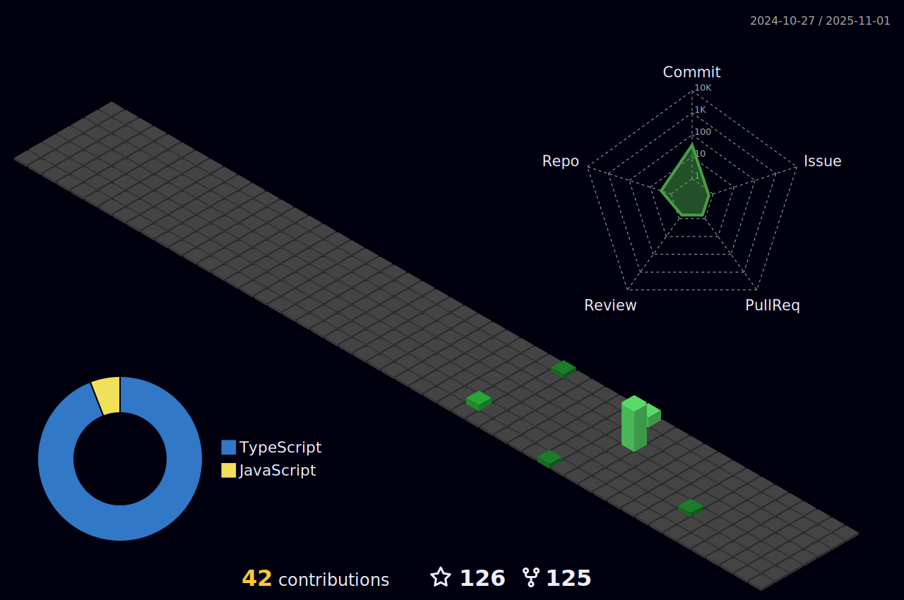

<h1 align="center">Hi, I'm Debraj Karmakar 👋</h1>

Perfection-obsessed Web Developer, currently I am a Computer Science Engineering student. My interests range from technology to design. I am also interested in art, creativity, entrepreneurship, and travel.
 
 
Loves open-sourcing cool projects on Github and helping the Web community on StackOverflow and Behance.
 
 
Currently 💻 Web and 🎨 Design enthusiast.

I'm a people person, let's connect!

&nbsp;

- 🔭 I’m currently working on **[Iprompt - Discover & share AI-powered prompts](https://github.com/debrajhyper/Iprompt)** - [live](https://iprompt.vercel.app)

- 🌱 I’m currently learning **[Ansible](https://docs.ansible.com/ansible/latest/index.html)** and developing proficiency with **Devops**

- 👨‍💻 All of my projects are available at [fueler.io/@debraj](https://fueler.io/debraj)

- 📝 I write blogs on [Hashnode](https://debrajkarmakar.hashnode.dev/)

- 💬 Ask me about **Designe or any tech related stuff**

- 📫 How to reach me **[debrajkarmakar010@gmail.com](debrajkarmakar010@gmail.com)**

- ⚡ Fun fact **I think I am funny XD 😛**

 

## 💌 Connect with me:

  

  

  

  

  

  

  

  

  <!--  -->

 

## 🎯 Things I code with:
&nbsp;
&nbsp;
&nbsp;
&nbsp;
&nbsp;
&nbsp;
&nbsp;
&nbsp;
&nbsp;
&nbsp;
&nbsp;

## ⚡ Frameworks/Library I use:
&nbsp;
&nbsp;
&nbsp;
&nbsp;
&nbsp;
&nbsp;
&nbsp;
&nbsp;

## 🔥 Tools I use:
&nbsp;
&nbsp;
&nbsp;
&nbsp;
&nbsp;
&nbsp;
&nbsp;
&nbsp;
&nbsp;
&nbsp;
&nbsp;
&nbsp;
&nbsp;
&nbsp;
&nbsp;
&nbsp;
&nbsp;
&nbsp;
&nbsp;
&nbsp;
&nbsp;

 

<h2 align="center">Profile Stats 📉</h2>
 

  
  
  

  

<!-- 

  

 -->

 

  

  

 

If you like my content, please consider buying me a coffee :coffee:
 
 
Thank you for your support! 

<!--  -->
